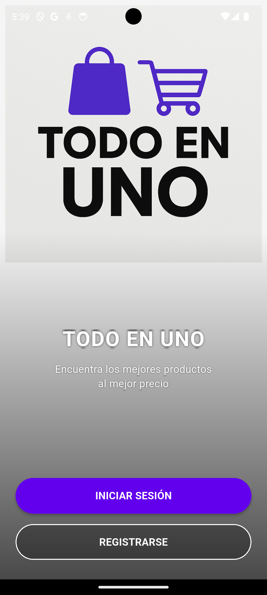

# store

A new Flutter project.

## Getting Started

This project is a starting point for a Flutter application.

A few resources to get you started if this is your first Flutter project:

- [Lab: Write your first Flutter app](https://docs.flutter.dev/get-started/codelab)
- [Cookbook: Useful Flutter samples](https://docs.flutter.dev/cookbook)

For help getting started with Flutter development, view the
[online documentation](https://docs.flutter.dev/), which offers tutorials,
samples, guidance on mobile development, and a full API reference.

# TodoEnUno - Aplicación de E-commerce Flutter

Aplicación de e-commerce desarrollada en Flutter con Firebase que permite a los usuarios explorar productos, gestionar un carrito de compras y realizar pedidos, con funcionalidades diferenciadas para usuarios y vendedores.

 

## Tabla de Contenidos
- [Características](#características)
- [Requisitos Técnicos](#requisitos-técnicos)
- [Configuración del Proyecto](#configuración-del-proyecto)
- [Guía de Usuario](#guía-de-usuario)
- [Guía para Vendedores](#guía-para-vendedores)

## Características

### Para Usuarios
- Autenticación con Email/Contraseña y Google Sign-In
- Exploración de catálogo de productos por categorías
- Vista detallada de productos
- Carrito de compras con gestión de cantidades

### Para Vendedores
- Panel de gestión de productos
- Añadir/editar productos
- Visualización de estadísticas de ventas

## Requisitos Técnicos

- Flutter 3.32.6 o superior
- Dart 3.0.0 o superior
- Firebase project configurado (Ya hecho)
- Dispositivo físico o emulador (Android)

## Configuración del Proyecto

Sigue estos pasos para configurar el proyecto localmente:
